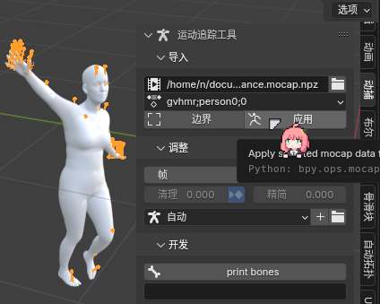

# mocap_importer 动捕导入者
Currently support gvhmr, wilor as `.npz` file.

## Use with 搭配使用
- [mocap-wrapper](https://github.com/AClon314/mocap-wrapper) to install/get mocap data.
- [smpl-x blender addon](https://download.is.tue.mpg.de/download.php?domain=smplx&sfile=smplx_blender_addon_lh_20241129.zip) or [source Code](https://gitlab.tuebingen.mpg.de/jtesch/smplx_blender_addon) to import smplx model.
- [rokoko blender addon](https://github.com/Rokoko/rokoko-studio-live-blender/releases) for bone remapping to any armature, free feature after log in.

## TODO
PR welcome! (ゝ∀･)

- only import selected bones
- remember which .npz for each armature

draft, done partly, not perfect:
- [track camera from gvhmr](https://github.com/zju3dv/GVHMR/issues/30)
- make wilor predict hands ID continuously